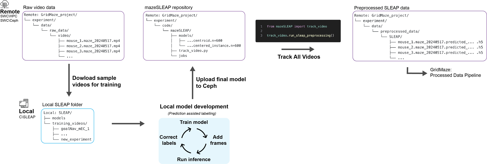
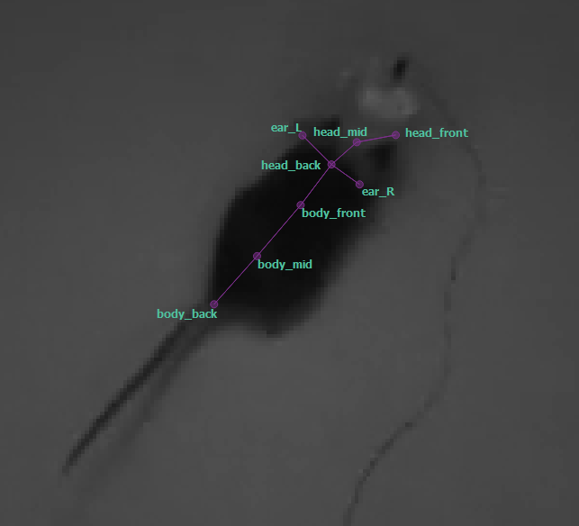
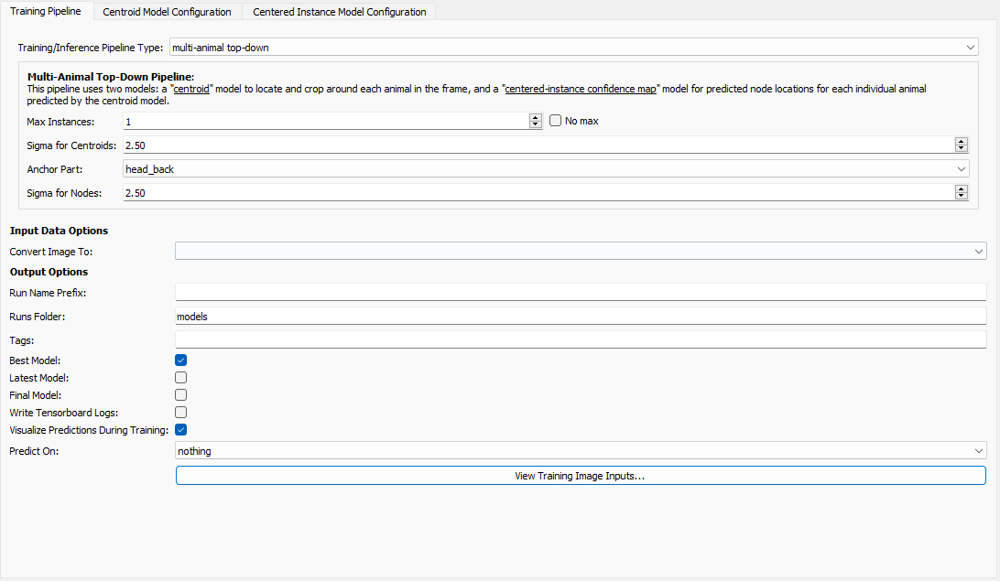
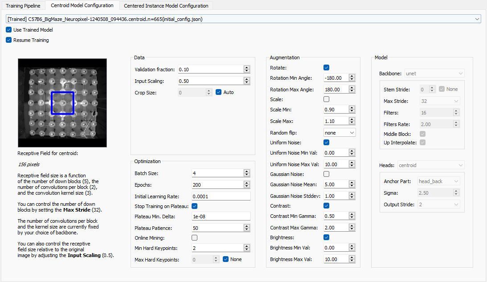
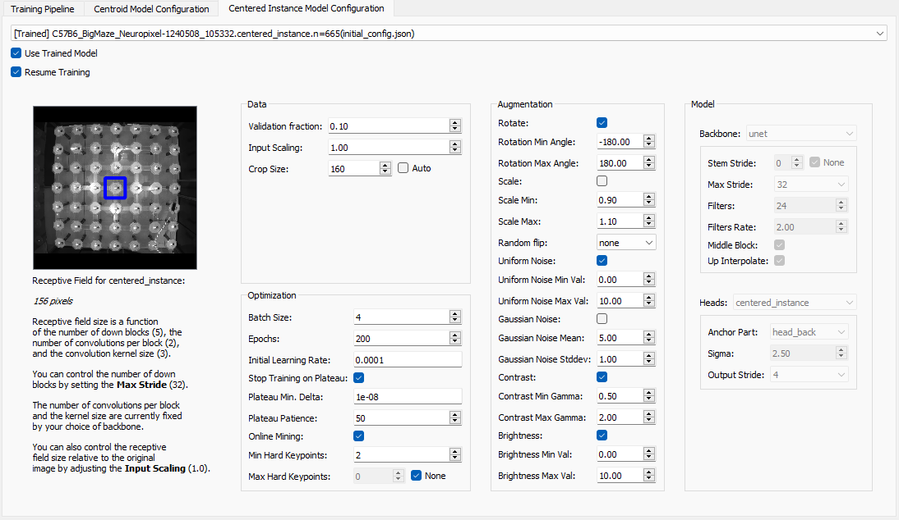
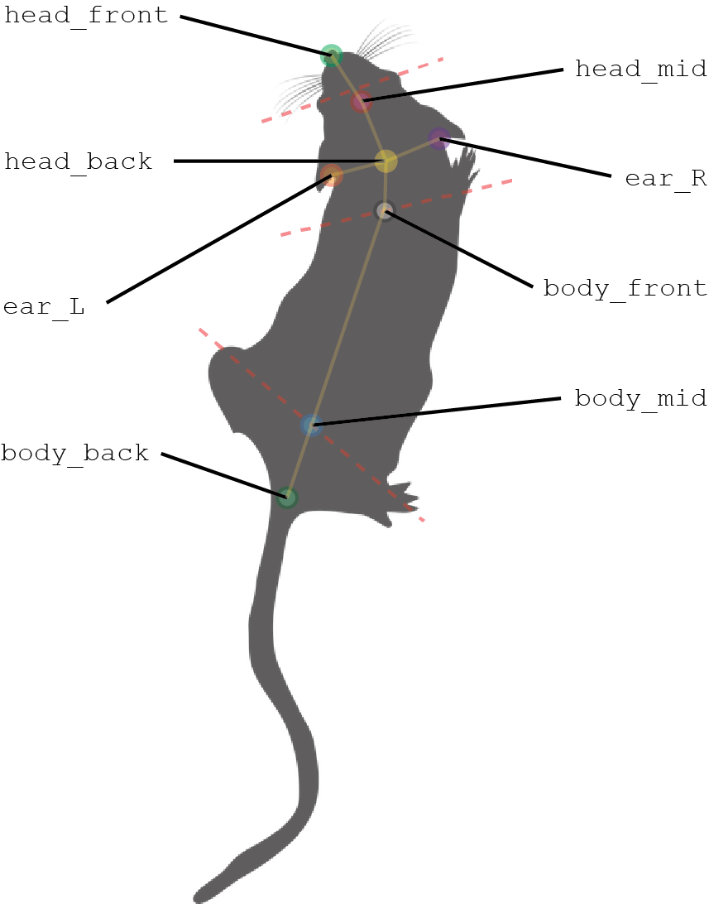

# Video Tracking for GridMaze Experiments with SLEAP
SLEAP is a deep-learning based framework for multi-animal pose tracking developed by the [Talmo Lab](https://www.nature.com/articles/s41592-022-01426-1). It can be used to track any number and type of animal, but for our GridMaze experiments we are just going to use it to track single mice on GridMaze apparatuses. SLEAP has a very well crafted GUI labelling system that makes training new models easy and intuitive, as well as a high-level API than makes running video-tracking on the HPC easy as well. 

## Overview 
This repository contains code and outlines the steps to preprocesses raw data collected from GridMaze experiments (.mp4 video files) into preprocessed tracking data (.h5 file) that lists the pixel coordinates of each mouse body-part over frames of video. To do this we start with model development and validation on a local computer and then move to the HPC to run parallelised tracking on large datasets.  

<div style="text-align: center;">
  
</div>

## Local SLEAP Model Development

### STEP 1: Familiarise yourself with the SLEAP documentation
To get a feel for how SLEAP works read through their [documentation](https://sleap.ai). Start by going through the 'Tutorial' then the Guides for the 'GUI', 'Skeleton Design' and 'Configuring Models'.


### STEP 2: Start a new SLEAP project
#### Local Folder Structure
```
Local: SLEAP/
├── models/
│   ├── C57B6_BigMaze_Neuropixel-1
│   ├── C57B6_OpenField_Neuropixel-1
│   └── ...
└── training_videos/
    ├── goalNav_mEC_1
    └── ...
```
Your local SLEAP folder should be strucuted as above, with a top level ```models``` folder that contains SLEAP projects for different tracking models, and ```training_videos``` that contains representative videos dowloaded from Ceph for model development. 
- ```model``` folders are labelled by ```mouse-background_GridMaze-apparatus_implant-type```
- ```training_video``` folders are labelled by experiment 
 

#### Launching the SLEAP GUI
- On your local workstation (eg, Alienware PC in Tinsley for Oxford), open a command line interface (eg, Anaconda Prompt - may need to run as administrator)
- Check if a python environment for SLEAP already exists with: ```conda env list```.
    - If needed, create a conda environment with SLEAP following their [documentation](https://sleap.ai/installation.html). 
- Launch the SLEAP GUI with:
    ```
    conda activate sleap
    sleap-label
    ```

#### Opening a SLEAP project
- If you need to develope a new tracking model (eg, if you are using a different mouse-background, GridMaze apparatus or implant type), open an exisiting SLEAP model that is most similar to the model you need to develope (eg, if you need to develope a model for C57B6 mice on the big_maze with a new type of implant/headcap start with the model ```C57B6_BigMaze_Neuropixel-1```)
    - From the SLEAP GUI open a project with ```File > Open Project ...``` and navigate to the .slp file within your model folder of interest
- Next, create a new folder within ```SLEAP/models``` and name appropriately and select ```File > Save As``` within the SLEAP GUI to save a new .slp file (SLEAP project file) to that folder. 
- If you don't need to develope a new SLEAP model (i.e. there exists a model for the same mouse-background, GridMaze-apparatus and implant-type), open the existing model you want to use and proceed to [STEP 6](#step-6-model-assessment).


### STEP 3: Download Training Videos
- From your dataset download some representative videos from Ceph into ```SLEAP/training_videos/<your_experiment>```. For example, one video from each subject at the begining and end of the experiment. 
    - Videos can be downloaded from Ceph via software like [FileZilla](https://filezilla-project.org), [winSCP](https://winscp.net/eng/index.php) or [VSCode's Remote SSH Extension](https://code.visualstudio.com/docs/remote/ssh).
- If you navigate to the ```Videos``` Tab in the SLEAP GUI you will see the training_videos added to the project you initialsied from. You can remove these videos and add you're own training videos with the ```Add Videos``` button. 
    - Optionally, you can keep videos from the model you initialised from to keep labelled frames from those videos for training. This might be useful if your new model is very similar to a previous one (eg, training a model for object open field sessions that contains the training frames from normal basic open field sessions). 
- This is a good point to save your new SLEAP project. 


### STEP 4: Prediction-assisted Labelling

#### Selecting Frames for Labeling
- Next we are going to select frames from your new training videos to label body-parts and train a new tracking model. 
- To generate frames for labelling, click the ```Labeling Suggestions``` Tab, Under ```Generate Suggestions``` select ```Method: image features``` and ```Target: all videos``` leaving all other settings set to defualt and hit ```Generate Suggestions```. 
- This will populate the table above (within the ```Labeling Suggestions``` tab) with new frames to label. You can double click on one of these frames to visualise it. 
- Newly suggested frames will not be 'labeled'. 

#### Prediciting Unlabeled Frames
- Instead of labeling each frame body-part by body-part we can use SLEAP's fantastic GUI to make some initial predictions 
- Click ```Predict > Run Inference```. In the Window that opens:
    - Under Inference Pipeline:
        - Set:
            ```Training/Inference Pipeline Type: Multi-animal top-down``` (see [Choosen Model Architecture](#choosen-model-architecture) for more details)
        - Set ```Max Instances: 1```
        - Set ```Tracker (cross-frame identity Method): none```
        - Set ```Predict on: Suggested Frames```
    - Under ```Centroid Model Configuration``` hit the drop-down menu and click ```Select training config file...```. 
        - Then search for the model you initialised from under ```SLEAP/models/<existing_model>/models/<most_recent_centroid_model>/train_config.json``` , where most recent cenroid model will be the folder with ```.centroid``` in the folder name (it will also have the hights number of labelled frames ```.n=<no_labeled_frames>```). 
    - Similarly, under ```Centered Instance Model Configuration```:
        - select the ```training_config.json``` in the ```SLEAP/models/<existing_model>/models``` folder that corresponds to the ```.centered_instance``` model. 
    - then hit ```Run``` 
- Now if you return to your suggested frames (and double click on one), you will see models best guess at where the body parts are! 
    <div style="text-align: center;">
        
    </div>

#### Correcting Inital Predictions
- To refine your model you will need to correct labelling mistakes.
- On each of your labelled frames double click on the skeleton and this should change the color and start showing the body-part names of each node. 
- Drag each node to its correct position (see [Body-part Definitions](#body-part-definitions))
    <div style="text-align: center;">
        
    </div>
- If the initial preidiction failed to find an instance (the mouse) on a given frame just find the zoom into the mouse on the frame, right click  and select ```Add Instance: Average```. Then drag the skeleton nodes to their correct position. 
- Repeat this for all suggested frames (or as many as you can manage). 

See the [SLEAP documentation](https://sleap.ai/tutorials/assisted-labeling.html) for further details and handy keyboard shortcuts. 

### STEP 5: Training
- Now its time to use you labeled frames to imporve your SLEAP model. 
- Click ```Predict > Run Training ...```
    - Configures setting under ```Training Pipeline``` as:
        <div style="text-align: center;">
            
        </div>
    - Under ```Centroid Model configuration```:
        - Select the centroid training config of the model you have initialised off (see [Predicting Unlabeled Frames](#prediciting-unlabeled-frames))or a previous configuration of your new model if you have run this step already. 
        - Select ```Resume Training```
        - Configure the other settings as:
        <div style="text-align: center;">
            
        </div>
    - Under ```Centered Instance Model Configuration```:
        - Select the centered_instance training config same as above
        - Select ```Resume Training```
        - Configure the other settings as:
        <div style="text-align: center;">
            
        </div>
- Hit ```Run``` to start training
- Training can take a few hours

### STEP 6: Model Assessment
- to get a feel for your model's performance post training, download a new video from Ceph to your local computer and load it into your SLEAP project, same as described in [STEP 3](#step-3-download-training-videos). 
- get suggested frames from you new video, same as described in [STEP 4](#prediciting-unlabeled-frames), except with the ```Target``` variable under ```Labeling Suggestions``` set to ```current video``` (after having double clicked on your new video in the video's tab). 
- Predict the labels on your new unlabeled frames by clicking ```Predict > Run Inferences...```, same as described in [STEP 4](#prediciting-unlabeled-frames)
- Check the model's predictions (new instances) visually. 
    - if its getting every body part spot on in almost every frame - you're done with local developement! 
    - if the model is missing the mouse all together or body-parts are not labelled well, download more videos, label more frames, and retrain the model (repeating STEPS 3-5). 

## Run SLEAP tracking on the HPC
- Once you are happy with your model's performance one some test frames, we can start tracking body-parts over entire session videos. 
- Running tracking on a full video can take an hour or two and requires a GPU. To speed things up we can processes many sessions in parallel, with multiple GPUs on the SWC's HPC. 

### STEP 1: Move models to Ceph
- You should have set up your project locally and on Ceph with the GridMaze standard folder structure, follow the documentation in [GridMaze-preprocessing](https://github.com/cognitive-circuits/GridMaze-preprocessing) for more info
- Clone this repo to your project's code folder:
    ````
    cd <GridMaze_project>/experiment/code
    git clone https://github.com/peterdoohan/mazeSLEAP-mEC.git
    ````
- Ensure that a models folder and jobs folders as in the repository so it has the following folder structure:
    ```
    Remote: mazeSLEAP/
    ├── models/
    │   ├── ...session_type_1.centroid...
    │   ├── ...session_type_1.centered_instance...
    │   ├── ...session_type_2.centroid...
    │   ├── ...session_type_2.centered_instance...
    │   └── ...
    ├── jobs/
    │   ├── slurm
    │   ├── err
    │   └── out
    ├── track_video.py
    └── .gitignore
    ```
- Next, upload the model you developed locally to ```mazeSLEAP/models```. You should have a centroid and centered instance model for each session_type in your experiment.
    - model folder names copied directly from your SLEAP model folder should look like: ```<model_name>.datetime_created.<centroid OR centered_instance>.n=<n labeled frames>```
    - eg, ```C57B6_BigMaze_Neuropixel-1.240508_094436.centroid.n=665```


### STEP 2: Set up a conda environment with SLEAP on the HPC
- Set up a conda environment with sleap on your remote machine following the [SLEAP documentation](https://sleap.ai/installation.html).

### STEP 3: Update track_video.py
- Open ```track_video.py``` from you cloned repo and maze any necessary changes:
    - Update the ```SESSION_TYPE2SLEAP_MODEL_NAME``` global variable with the session types and model names from you experiment 
    - eg, for maze sessions that will use the model from ```C57B6_BigMaze_Neuropixel-1.240508_094436.centroid.n=665``` folder enter:
        ```
        SESSION_TYPE2SLEAP_MODEL_NAM = {'maze':'C57B6_BigMaze_Neuropixel-1'}
        ```
    - the other global variables shouldn't need changes, unless you are saving your raw_data and preprocessed_data differently to GridMaze standard.
- In an iPython terminal or interactive-notebook running from your code folder, run:
    ```
    from mazeSLEAP import track_video as tv
    predictor = tv.load_sleap_predictor('maze') 
    ```
    to check that your model(s) are loading correclty. 

### STEP 4: Submitting jobs to the cluster
- Next, generate a pd.DataFrame with information about the raw data videos from your experiment to be processed. From the same iPython terminal or interactive-notebook generated above run:
    ```
    video_paths_df = tv.get_video_paths_df()
    ```
- Inspecting this dataframe will show you information about all the videos from your experiment and whether sleap preprocessing has already been completed for a given session session ('tracking_completed' column). 
    - if you get an error trying to generate the ```video_paths_df``` its likely because the naming convention in your video files differs from other datasets and you may need to update code in the ```get_video_paths_df``` function to account for this. 
- Once you have made these check simply run:
    ```
    tv.run_sleap_preprocessing()
    ```
    in your iPython terminal or interactive-notebook or simply run track_video.py from the command line. 
    - This function submits a job to the HPC For every unprocessed session in ```video_paths_df``` to track the body-parts in the raw_data video and save the outputs as an .h5 file in ```data/preprocessed_data/SLEAP```. 
    - These files are later loaded in GridMaze-prepocessing and processed further. 
- Note:
    - Some of the jobs submitted to the cluster with fail (usually due to not enough GPU ram being allocated to the job). 
    - Rerunning: 
        ```
        tv.run_sleap_preprocessing()
        ```
        will resubmit any sessions that have not been processed yet. 
    - You can check which sessions have not been preprocessed get by running:
        ```
        from mazeSLEAP import track_video as tv
        video_paths_df = tv.get_video_paths_df()
        print(video_paths_df[~video_paths_df.tracking_completed])
        ```

## Body-part Definitions
GridMaze-preprocessing requires the following body-parts to be labelled on each video-frame of a session:
- **head_front**: Nose of the mouse
- **head_mid**: Middle of the head, just behind the midpoint between the eyes
- **head_back**: Back of the head, just behind the midline of the ears
- **ear_L**: Back of the left ear where the fur meets the skin
- **ear_R**: Back of the right ear where the fur meets the skin
- **body_front**: Midpoint between left and right hands
- **body_mid**: Midpoint betwen left and right feet
- **body_back**: Base of the tail

<div style="text-align: center;">
  
</div>
Above is schematic of where to mark each body-part during SLEAP labelling. 

## Choosen Model Architecture
- SLEAP offers differnt model architectures, after some inital testing we have opted to use their 'top-down' model. 
- the top-down model consists of two netowrks
    - the ```centroid``` model that finds the animal in each frame, then
    - the ```centered_instance``` model estimates the pose of each frame.
- see the [SLEAP documentation](https://sleap.ai/tutorials/initial-training.html) for more details

